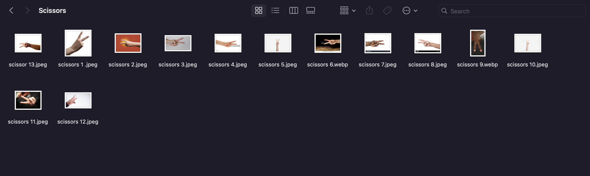

# Computer Vision RPS

Milestone 1
---
In this milestone I had the simple task of creating a new repository for the Computer Vision Project. I will save all the relevant folders and work for this project on the repository. The advantage of using a Repository is because it allows us to to save various versions of the project and creates a mind map of the progress of the project until it is completed. Repositorires also allow me to share my current work with the public and allows other colleagues to access and make changes to improve the code with my permission.

Milestone 2
---
In the task I had to create the computer vision system (model) that will detect if the user throwing Rock, Paper or Scissors.
   
   - In the first task I had to create an image project model with 4 different classes consisting of Rock, Paper, Scissors and Nothing. To achieve this I had to use Teachable-Machine  to start creating the model.

   - As the picture above displays Teachable-machine allows you create to creat models based on images or audio. For this project I used the images create my model as it will be using hand gestures. 

   - I created 4 classes for Rock, Paper or Scissors and Nothing that will represent the lack of option in the image.

   - To start creating the model, each class is trained with images of myself showing each option to the camera.I then proceeded or saved pictures from the internet representing each gesture as the pictures above depict. I encountered difficulties when the model was  getting confused between paper and scissors. To rectify this I employed the webcam function which allows me to use the webcam to take various angles and perceptions of the two gestures so they ca be better differentiated. When there was sufficient pictures oof the gestures proceeded to train the model which then recognised the gesture I was dipslaying infront of the webcam as the picture belowe demostrates.

   - To complete this task I dowloaded the model using the "Tensorflow" tab in Teachable-Machine. The model dwnload created two files keras_model.h5 which is the model and the text file containing the labels should be named labels.txt. Also as you download the code Teachable-Machine displays how to downlaod and integrate your model into your code which I found helpful (check modelcode.png). 
   - The files that I downloading contain the structure and the parameters of the learning model I created. The files that are downloaded do not contain any readable information inside then them nor can they be run, However I will have us for them in the next milestone.
Make sure you push the model and labels to your GitHub repository after committing.

Milestone 3
---

Milestone 4 
---

Milestone 5
---