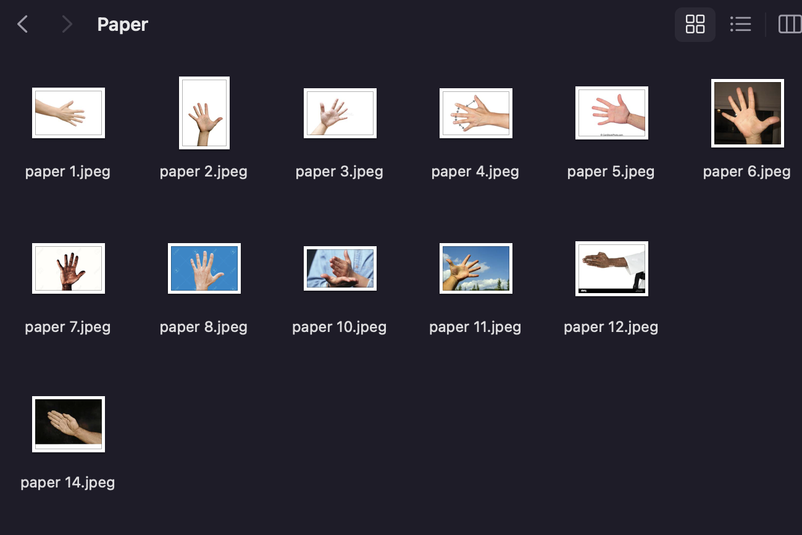
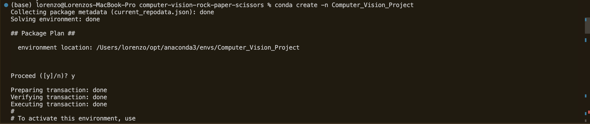
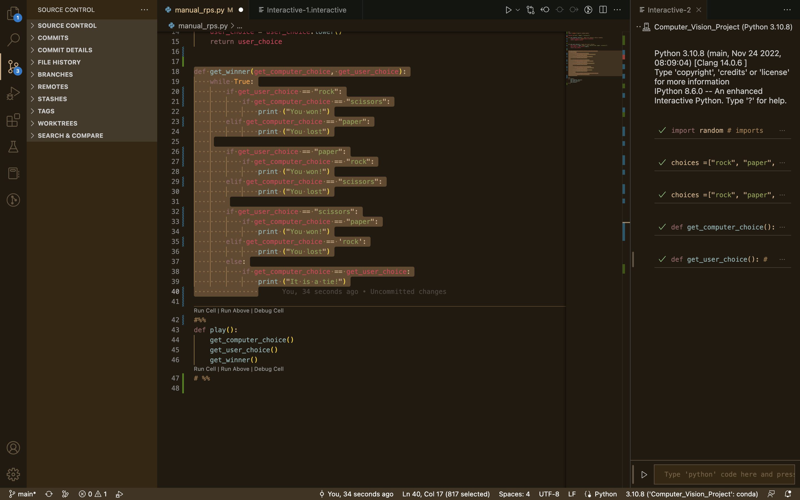

# Computer Vision RPS

Milestone 1
---
In this milestone I had the simple task of creating a new repository for the Computer Vision Project. I will save all the relevant folders and work for this project on the repository. The advantage of using a Repository is because it allows us to to save various versions of the project and creates a mind map of the progress of the project until it is completed. Repositorires also allow me to share my current work with the public and allows other colleagues to access and make changes to improve the code with my permission.

Milestone 2
---
In the task I had to create the computer vision system (model) that will detect if the user throwing Rock, Paper or Scissors.
   
   - In the first task I had to create an image project model with 4 different classes consisting of Rock, Paper, Scissors and Nothing. To achieve this I had to use Teachable-Machine  to start creating the model.

   - As the picture above displays Teachable-machine allows you create to creat models based on images or audio. For this project I used the images create my model as it will be using hand gestures. 

   - I created 4 classes for Rock, Paper or Scissors and Nothing that will represent the lack of option in the image.

   - To start creating the model, each class is trained with images of myself showing each option to the camera.I then proceeded or saved pictures from the internet representing each gesture as the pictures above depict. I encountered difficulties when the model was  getting confused between paper and scissors. To rectify this I employed the webcam function which allows me to use the webcam to take various angles and perceptions of the two gestures so they ca be better differentiated. When there was sufficient pictures oof the gestures proceeded to train the model which then recognised the gesture I was dipslaying infront of the webcam as the picture belowe demostrates.

   - To complete this task I dowloaded the model using the "Tensorflow" tab in Teachable-Machine. The model dwnload created two files keras_model.h5 which is the model and the text file containing the labels should be named labels.txt. Also as you download the code Teachable-Machine displays how to downlaod and integrate your model into your code which I found helpful (check modelcode.png). 
   - The files that I downloading contain the structure and the parameters of the learning model I created. The files that are downloaded do not contain any readable information inside then them nor can they be run, However I will have us for them in the next milestone. These will be stored in the RPS repository on github.

Milestone 3
---
- in this milestone I needed to install Conda which is an open source package management system and environment management system. Conda quickly installs, runs and updates packages and their dependencies. To do this I downloaded conda onto my laptop and proceeded to create a new environment. The package manager installed with instructions of how to create basic environements by following the steps provided as the snippet displays. To cretate an enevironment I had to run conda create -n my_env python=3.10, which produced an environment with a name I could I set.

- After I activated the environment,I then I installed pip by running the following command in the terminal conda install pip. As the picture below protrays, the command then installed the pip which will allow me to install the necessaary requirements.

- To install thE of the libraries, I had to run the follwoing command  pip install <library> the name of the libray. The install the necessary libraries that the model I downloadeD earlier depends on. i needed to download the following libraries: opencv-python, tensorflow, and ipykernel. The screenshot below shows an exmaple of the installing the opencv-python.

- After installing the libraries, I had to create a requirements.txt file by running the following command: pip list > requirements.txt. This file allows any other user that wants to use my computer to easily install these exact dependencies by running: pip install requirements.txt. This created a file which is saved in the same folder cann viewed in the picture below.
- I then had to run the file below to check if the model I downloaded is working as expected, ask the screenshot below will display there were no isssues regarding the piece of code. I had to try and get used to the code as they give the probability o fthe classes I created earlier.

Milestone 4 
---
- In this task I started by creating another file called manual_rps.py that will be used to play the game without the camera. The first thing I had to do was to import the random module to pick a random option between rock, paper, and scissors.
- I had to create two functions: 
   1.  I achieved this by using basic python syntax such def get_computer_choice () to define my function. I then created a variable computer_variable and assigning it a random value from 3 choices of RSP. This allowed me to randomly pick an option between "Rock", "Paper", and "Scissors" and returned the choice.
   2. The second function asks the user for an input and returns it. To accomplish this I defined the get_user_choice () function. In the body of that function I used the varibale user_choice to be equal to input ().lower to return the input as lower case letters. as I progressed I changed my code to make it look clean and more presentable using improved and consise naming.

- In this task I had to create code using if-elif-else statement to allow the script to be able to choose a winner based on the classic rules of Rock-Paper-Scissors. To achive this I defined my get_winner() function that takes two arguments: computer_choice and user_choice. As displayed below I wrote that for the following conditions:
   If the computer wins, the function should print "You lost", 
   if the user wins, the function should print "You won!", and 
   if it's a tie, the function should print "It is a tie!".

- In this task I had to wrap it all in one function as it is all for running the game. To do this I defined a function called play(). In the body of this function I called the 3 functions I created in the milestones above (get_computer_choice, get_user_choice, and get_winner). After creating the function I then called it was only running the else statement and i then had to trouble shoot ths to see what the issue was. After going over the prerequisite material i then got my code in order realised why placement is very important in python code. After troubleshooting when I run the code,it plays a game of Rock-Paper-Scissors, and prints whether the computer or user won.

Milestone 5
---
- I this task I had to create a new file called camera_rps.py where the new code, to replace the hard-coded user guess with the output of the computer vision model. To acheive this I created a new function called get_prediction and placed the code from CV in the body of this function so it will return the output of the model.

- In this task I had to add a counter that will count down for the user to show their choice. To achieve this I had to import the time module and set up a count timer in the body of the get prediction method. By using the following variables: start, end_time and countdown I was able to create a countdown that will display show your hand in {seconds} to the user. When the countdown gets to zero it will command the user to present their choice.

- In this task i wrote code for the game to be repeated until either the computer or the user wins three rounds. To achieve this I initialised the class with the following attributes: computer_wins and user_wins set at zero. Then in get winner i returned the winner with a value of added to the attribute. I then coded for the for the game to end when either the user or the computer has accumulated 3 points.

